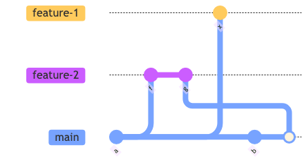
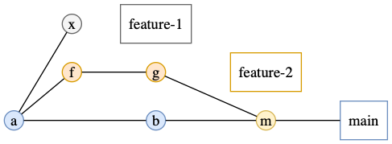

//tag::vardef[]
:gh-repo-owner: jmini
:gh-repo-name: GitGraph4J
:project-name: GitGraph4J
:branch: main
:twitter-handle: j2r2b
:license: http://www.apache.org/licenses/LICENSE-2.0
:license-name: Apache 2.0 License

:git-repository: {gh-repo-owner}/{gh-repo-name}
:homepage: https://{gh-repo-owner}.github.io/{gh-repo-name}
:issues: https://github.com/{git-repository}/issues
//end::vardef[]

//tag::header[]
= {project-name}
Jeremie Bresson

Java code to create "git graph" images (targeting mainly the `Diagrams.net` (`\*.drawio` file) output format and supporting `Mermaid` (`*.mmd` file) and `Graphviz` (`*.dot` file) outputs as well).

//end::header[]

image:https://circleci.com/gh/{gh-repo-owner}/{gh-repo-name}.svg?style=svg["CircleCI", link="https://circleci.com/gh/{gh-repo-owner}/{gh-repo-name}"]

**link:https://www.diagrams.net/[Diagrams.net / Draw.io] output:**

image:src/docs/asciidoc/examples/diag03/graph.drawio.png[]

**link:https://mermaid-js.github.io/mermaid/#/gitgraph[Mermaid] output:**

**link:https://graphviz.org/[Dot / Graphviz] output:**

== Project Homepage

Visit the link:{homepage}[project home page] or the link:{homepage}/examples.html[examples page] to know more about this project.

//tag::contact-section[]
== Get in touch

Use the link:{issues}[{project-name} issue tracker] on GitHub.

You can also contact me on Twitter: link:https://twitter.com/{twitter-handle}[@{twitter-handle}]
//end::contact-section[]

//tag::license-section[]
== License

link:{license}[{license-name}]
//end::license-section[]
