:rootdir: ../../..
:github-readme: {rootdir}/README.adoc
:revdate: {project-builddate}
:revnumber: {project-version}

include::{github-readme}[tags=vardef]

== Examples
Here some diagrams used to develop of the code:

=== diag01

Diagrams.net:

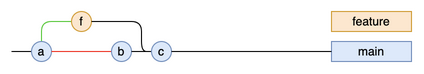

git-link:src/docs/asciidoc/examples/diag01/graph.drawio[view source file, view] - link:https://app.diagrams.net/?src=https://app.diagrams.net/?src=https://raw.githubusercontent.com/jmini/GitGraph4J/main/src/docs/asciidoc/examples/diag01/graph.drawio#Uhttps%3A%2F%2Fraw.githubusercontent.com%2Fjmini%2FGitGraph4J%2Fmain%2Fsrc%2Fdocs%2Fasciidoc%2Fexamples%2Fdiag01%2Fgraph.drawio[edit file on diagrams.net]

Mermaid:

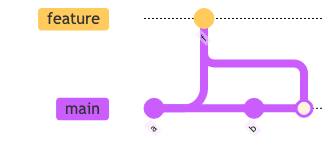

git-link:src/docs/asciidoc/examples/diag01/graph.mmd[view source file, view]

Dot (Graphviz):

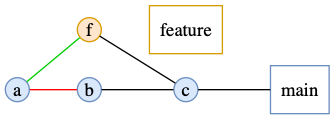

git-link:src/docs/asciidoc/examples/diag01/graph.gv[view source file, view]

=== diag02

Diagrams.net:

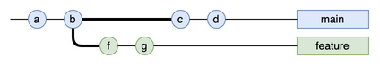

git-link:src/docs/asciidoc/examples/diag02/graph.drawio[view source file, view] - link:https://app.diagrams.net/?src=https://app.diagrams.net/?src=https://raw.githubusercontent.com/jmini/GitGraph4J/main/src/docs/asciidoc/examples/diag02/graph.drawio#Uhttps%3A%2F%2Fraw.githubusercontent.com%2Fjmini%2FGitGraph4J%2Fmain%2Fsrc%2Fdocs%2Fasciidoc%2Fexamples%2Fdiag02%2Fgraph.drawio[edit file on diagrams.net]

Mermaid:

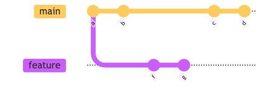

git-link:src/docs/asciidoc/examples/diag02/graph.mmd[view source file, view]

Dot (Graphviz):

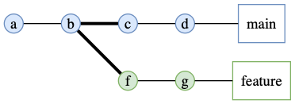

git-link:src/docs/asciidoc/examples/diag02/graph.gv[view source file, view]

=== diag03

Diagrams.net:

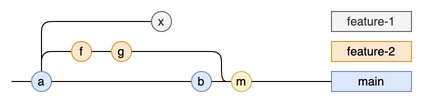

git-link:src/docs/asciidoc/examples/diag03/graph.drawio[view source file, view] - link:https://app.diagrams.net/?src=https://app.diagrams.net/?src=https://raw.githubusercontent.com/jmini/GitGraph4J/main/src/docs/asciidoc/examples/diag03/graph.drawio#Uhttps%3A%2F%2Fraw.githubusercontent.com%2Fjmini%2FGitGraph4J%2Fmain%2Fsrc%2Fdocs%2Fasciidoc%2Fexamples%2Fdiag03%2Fgraph.drawio[edit file on diagrams.net]

Mermaid:

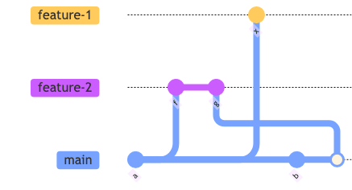

git-link:src/docs/asciidoc/examples/diag03/graph.mmd[view source file, view]

Dot (Graphviz):

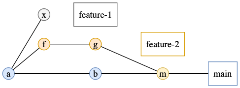

git-link:src/docs/asciidoc/examples/diag03/graph.gv[view source file, view]

=== diag04

Diagrams.net:

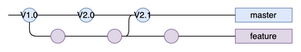

git-link:src/docs/asciidoc/examples/diag04/graph.drawio[view source file, view] - link:https://app.diagrams.net/?src=https://app.diagrams.net/?src=https://raw.githubusercontent.com/jmini/GitGraph4J/main/src/docs/asciidoc/examples/diag04/graph.drawio#Uhttps%3A%2F%2Fraw.githubusercontent.com%2Fjmini%2FGitGraph4J%2Fmain%2Fsrc%2Fdocs%2Fasciidoc%2Fexamples%2Fdiag04%2Fgraph.drawio[edit file on diagrams.net]

Mermaid:

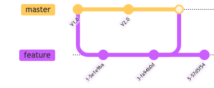

git-link:src/docs/asciidoc/examples/diag04/graph.mmd[view source file, view]

Dot (Graphviz):

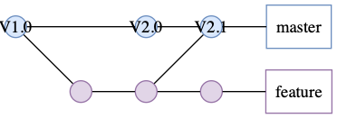

git-link:src/docs/asciidoc/examples/diag04/graph.gv[view source file, view]

=== diag05

Diagrams.net:

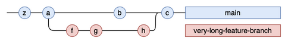

git-link:src/docs/asciidoc/examples/diag05/graph.drawio[view source file, view] - link:https://app.diagrams.net/?src=https://app.diagrams.net/?src=https://raw.githubusercontent.com/jmini/GitGraph4J/main/src/docs/asciidoc/examples/diag05/graph.drawio#Uhttps%3A%2F%2Fraw.githubusercontent.com%2Fjmini%2FGitGraph4J%2Fmain%2Fsrc%2Fdocs%2Fasciidoc%2Fexamples%2Fdiag05%2Fgraph.drawio[edit file on diagrams.net]

Mermaid:

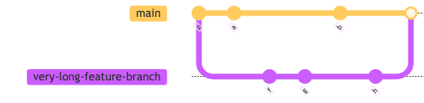

git-link:src/docs/asciidoc/examples/diag05/graph.mmd[view source file, view]

Dot (Graphviz):

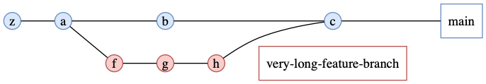

git-link:src/docs/asciidoc/examples/diag05/graph.gv[view source file, view]

=== diag06

Diagrams.net:

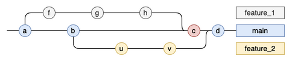

git-link:src/docs/asciidoc/examples/diag06/graph.drawio[view source file, view] - link:https://app.diagrams.net/?src=https://app.diagrams.net/?src=https://raw.githubusercontent.com/jmini/GitGraph4J/main/src/docs/asciidoc/examples/diag06/graph.drawio#Uhttps%3A%2F%2Fraw.githubusercontent.com%2Fjmini%2FGitGraph4J%2Fmain%2Fsrc%2Fdocs%2Fasciidoc%2Fexamples%2Fdiag06%2Fgraph.drawio[edit file on diagrams.net]

Mermaid:

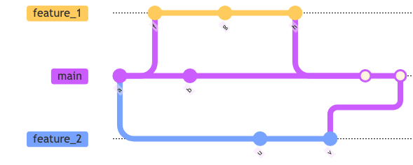

git-link:src/docs/asciidoc/examples/diag06/graph.mmd[view source file, view]

Dot (Graphviz):

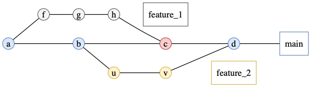

git-link:src/docs/asciidoc/examples/diag06/graph.gv[view source file, view]

=== diag07

Diagrams.net:

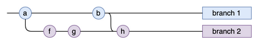

git-link:src/docs/asciidoc/examples/diag07/graph.drawio[view source file, view] - link:https://app.diagrams.net/?src=https://app.diagrams.net/?src=https://raw.githubusercontent.com/jmini/GitGraph4J/main/src/docs/asciidoc/examples/diag07/graph.drawio#Uhttps%3A%2F%2Fraw.githubusercontent.com%2Fjmini%2FGitGraph4J%2Fmain%2Fsrc%2Fdocs%2Fasciidoc%2Fexamples%2Fdiag07%2Fgraph.drawio[edit file on diagrams.net]

Mermaid:

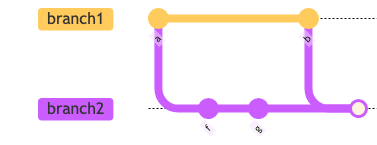

git-link:src/docs/asciidoc/examples/diag07/graph.mmd[view source file, view]

Dot (Graphviz):

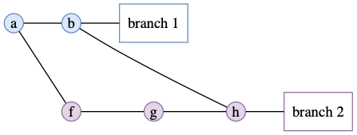

git-link:src/docs/asciidoc/examples/diag07/graph.gv[view source file, view]

=== diag08

Diagrams.net:

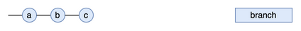

git-link:src/docs/asciidoc/examples/diag08/graph.drawio[view source file, view] - link:https://app.diagrams.net/?src=https://app.diagrams.net/?src=https://raw.githubusercontent.com/jmini/GitGraph4J/main/src/docs/asciidoc/examples/diag08/graph.drawio#Uhttps%3A%2F%2Fraw.githubusercontent.com%2Fjmini%2FGitGraph4J%2Fmain%2Fsrc%2Fdocs%2Fasciidoc%2Fexamples%2Fdiag08%2Fgraph.drawio[edit file on diagrams.net]

Mermaid:

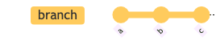

git-link:src/docs/asciidoc/examples/diag08/graph.mmd[view source file, view]

Dot (Graphviz):

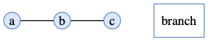

git-link:src/docs/asciidoc/examples/diag08/graph.gv[view source file, view]

=== diag09

Diagrams.net:

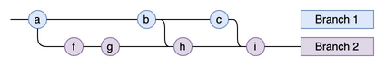

git-link:src/docs/asciidoc/examples/diag09/graph.drawio[view source file, view] - link:https://app.diagrams.net/?src=https://app.diagrams.net/?src=https://raw.githubusercontent.com/jmini/GitGraph4J/main/src/docs/asciidoc/examples/diag09/graph.drawio#Uhttps%3A%2F%2Fraw.githubusercontent.com%2Fjmini%2FGitGraph4J%2Fmain%2Fsrc%2Fdocs%2Fasciidoc%2Fexamples%2Fdiag09%2Fgraph.drawio[edit file on diagrams.net]

Mermaid:

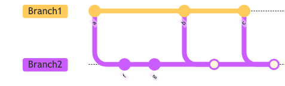

git-link:src/docs/asciidoc/examples/diag09/graph.mmd[view source file, view]

Dot (Graphviz):

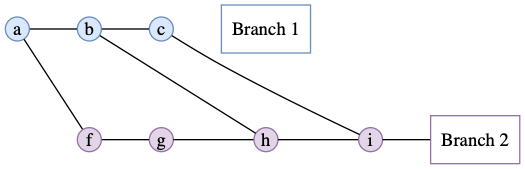

git-link:src/docs/asciidoc/examples/diag09/graph.gv[view source file, view]

=== diag10

Diagrams.net:

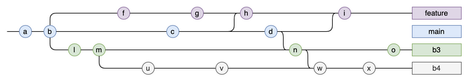

git-link:src/docs/asciidoc/examples/diag10/graph.drawio[view source file, view] - link:https://app.diagrams.net/?src=https://app.diagrams.net/?src=https://raw.githubusercontent.com/jmini/GitGraph4J/main/src/docs/asciidoc/examples/diag10/graph.drawio#Uhttps%3A%2F%2Fraw.githubusercontent.com%2Fjmini%2FGitGraph4J%2Fmain%2Fsrc%2Fdocs%2Fasciidoc%2Fexamples%2Fdiag10%2Fgraph.drawio[edit file on diagrams.net]

Mermaid:

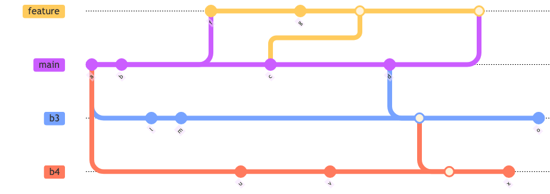

git-link:src/docs/asciidoc/examples/diag10/graph.mmd[view source file, view]

Dot (Graphviz):

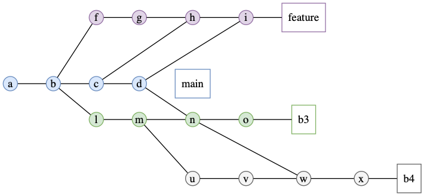

git-link:src/docs/asciidoc/examples/diag10/graph.gv[view source file, view]

=== diag11

Diagrams.net:

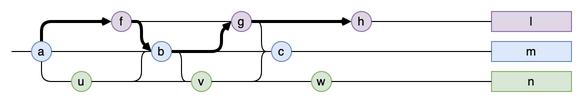

git-link:src/docs/asciidoc/examples/diag11/graph.drawio[view source file, view] - link:https://app.diagrams.net/?src=https://app.diagrams.net/?src=https://raw.githubusercontent.com/jmini/GitGraph4J/main/src/docs/asciidoc/examples/diag11/graph.drawio#Uhttps%3A%2F%2Fraw.githubusercontent.com%2Fjmini%2FGitGraph4J%2Fmain%2Fsrc%2Fdocs%2Fasciidoc%2Fexamples%2Fdiag11%2Fgraph.drawio[edit file on diagrams.net]

Mermaid:

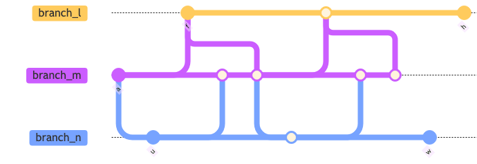

git-link:src/docs/asciidoc/examples/diag11/graph.mmd[view source file, view]

Dot (Graphviz):

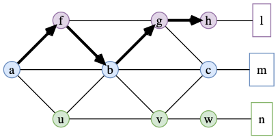

git-link:src/docs/asciidoc/examples/diag11/graph.gv[view source file, view]

=== diag12

Diagrams.net:

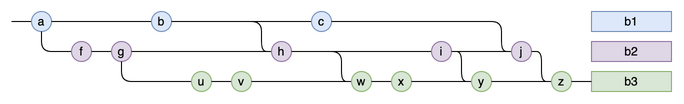

git-link:src/docs/asciidoc/examples/diag12/graph.drawio[view source file, view] - link:https://app.diagrams.net/?src=https://app.diagrams.net/?src=https://raw.githubusercontent.com/jmini/GitGraph4J/main/src/docs/asciidoc/examples/diag12/graph.drawio#Uhttps%3A%2F%2Fraw.githubusercontent.com%2Fjmini%2FGitGraph4J%2Fmain%2Fsrc%2Fdocs%2Fasciidoc%2Fexamples%2Fdiag12%2Fgraph.drawio[edit file on diagrams.net]

Mermaid:

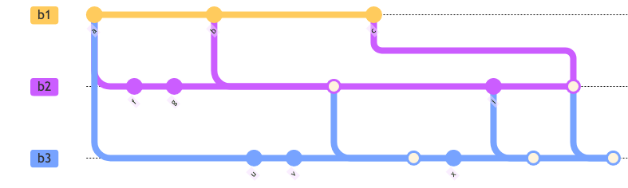

git-link:src/docs/asciidoc/examples/diag12/graph.mmd[view source file, view]

Dot (Graphviz):

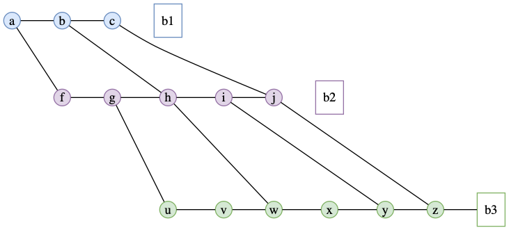

git-link:src/docs/asciidoc/examples/diag12/graph.gv[view source file, view]

=== diag13

Diagrams.net:

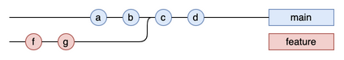

git-link:src/docs/asciidoc/examples/diag13/graph.drawio[view source file, view] - link:https://app.diagrams.net/?src=https://app.diagrams.net/?src=https://raw.githubusercontent.com/jmini/GitGraph4J/main/src/docs/asciidoc/examples/diag13/graph.drawio#Uhttps%3A%2F%2Fraw.githubusercontent.com%2Fjmini%2FGitGraph4J%2Fmain%2Fsrc%2Fdocs%2Fasciidoc%2Fexamples%2Fdiag13%2Fgraph.drawio[edit file on diagrams.net]

Mermaid:

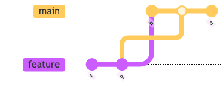

git-link:src/docs/asciidoc/examples/diag13/graph.mmd[view source file, view]

Dot (Graphviz):

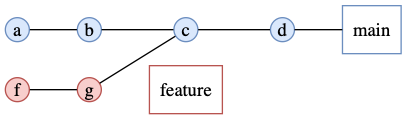

git-link:src/docs/asciidoc/examples/diag13/graph.gv[view source file, view]

=== diag14

Diagrams.net:

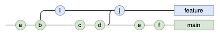

git-link:src/docs/asciidoc/examples/diag14/graph.drawio[view source file, view] - link:https://app.diagrams.net/?src=https://app.diagrams.net/?src=https://raw.githubusercontent.com/jmini/GitGraph4J/main/src/docs/asciidoc/examples/diag14/graph.drawio#Uhttps%3A%2F%2Fraw.githubusercontent.com%2Fjmini%2FGitGraph4J%2Fmain%2Fsrc%2Fdocs%2Fasciidoc%2Fexamples%2Fdiag14%2Fgraph.drawio[edit file on diagrams.net]

Mermaid:

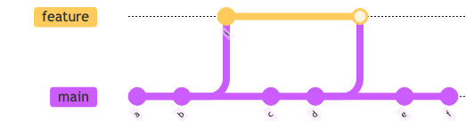

git-link:src/docs/asciidoc/examples/diag14/graph.mmd[view source file, view]

Dot (Graphviz):

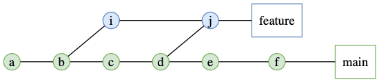

git-link:src/docs/asciidoc/examples/diag14/graph.gv[view source file, view]

=== diag15

Diagrams.net:

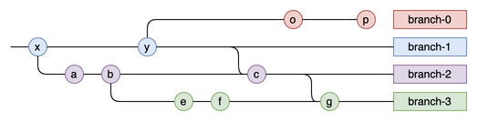

git-link:src/docs/asciidoc/examples/diag15/graph.drawio[view source file, view] - link:https://app.diagrams.net/?src=https://app.diagrams.net/?src=https://raw.githubusercontent.com/jmini/GitGraph4J/main/src/docs/asciidoc/examples/diag15/graph.drawio#Uhttps%3A%2F%2Fraw.githubusercontent.com%2Fjmini%2FGitGraph4J%2Fmain%2Fsrc%2Fdocs%2Fasciidoc%2Fexamples%2Fdiag15%2Fgraph.drawio[edit file on diagrams.net]

Mermaid:

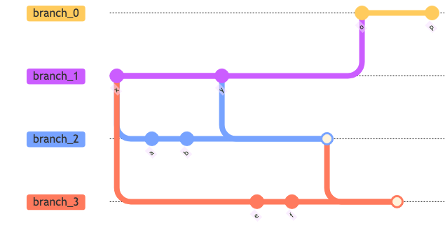

git-link:src/docs/asciidoc/examples/diag15/graph.mmd[view source file, view]

Dot (Graphviz):

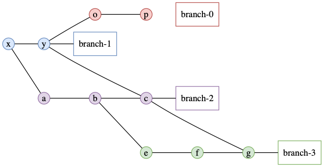

git-link:src/docs/asciidoc/examples/diag15/graph.gv[view source file, view]

=== diag16

Diagrams.net:

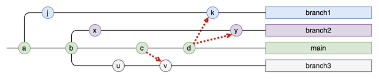

git-link:src/docs/asciidoc/examples/diag16/graph.drawio[view source file, view] - link:https://app.diagrams.net/?src=https://app.diagrams.net/?src=https://raw.githubusercontent.com/jmini/GitGraph4J/main/src/docs/asciidoc/examples/diag16/graph.drawio#Uhttps%3A%2F%2Fraw.githubusercontent.com%2Fjmini%2FGitGraph4J%2Fmain%2Fsrc%2Fdocs%2Fasciidoc%2Fexamples%2Fdiag16%2Fgraph.drawio[edit file on diagrams.net]

Mermaid:

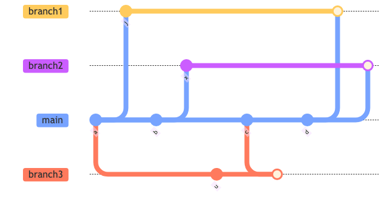

git-link:src/docs/asciidoc/examples/diag16/graph.mmd[view source file, view]

Dot (Graphviz):

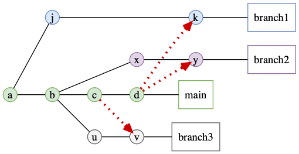

git-link:src/docs/asciidoc/examples/diag16/graph.gv[view source file, view]

